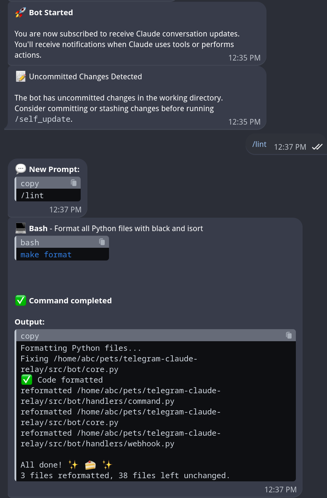

# Claude Code Telegram Bot

A Telegram bot that acts as a relay between Telegram and Claude Code running in a tmux pane.

## What it does

- Receives messages from Telegram
- Forwards them to Claude Code in a tmux pane
- Track Claude activity (including thinking steps) via hooks
- Returns Claude's responses back to Telegram
- Parse Claude's permissions options and send them as inline keyboard buttons

## Screenshot



## Setup

### Prerequisites

- Python 3.8+
- `tmux` installed
- Claude Code CLI installed and authenticated

### 1. Create Your Telegram Bot (Required)

1. Message [@BotFather](https://t.me/BotFather) on Telegram
2. Send `/newbot` and follow the prompts
3. Save your bot token (looks like: `1234567890:ABCdefGHIjklMNOpqrsTUVwxyz`)
4. Get your Telegram user ID (message [@userinfobot](https://t.me/userinfobot))
5. Optional: send `/setuserpic` command to @BotFather, select your bot and upload `BotAvatar.svg` as a photo to change avatar image.

### 2. Installation

```bash
# Clone and enter directory
git clone https://github.com/coffebar/telegram-claude-relay
cd telegram-claude-relay

# Configure your bot
cp .env.example .env
# Edit .env with your bot token and user ID from step 1

# Complete setup (dependencies + Claude hooks)
make setup-full
```

### 3. Start Claude in tmux

Open a tmux session in any directory where you want to work:

```bash
# Start tmux and Claude
tmux new-session -s my-coding-session
cd /path/to/your/project
claude
```

### 4. Run the Bot

```bash
# In a separate terminal
cd telegram-claude-relay
make run
# or specify a .env file for a specific bot:
make run 2          # For .env.2
```

## Usage

1. Start Claude in any tmux session (in your project directory)
2. Run the bot with `make run`
3. Message your bot on Telegram
4. Your messages go directly to Claude
5. Claude's responses come back with live tool updates

The bot uses Claude Code hooks to provide real-time tool notifications and live-updating status messages.

### Bot Commands

- `/start` - Show welcome message
- `/self_update` - Update bot from GitHub and restart automatically
- Any other text - Sent directly to Claude (including `/clear`, `/compact`, etc.)

## Features

- **Real-time Tool Transparency**: See exactly what Claude is doing with full code display (including subagent communications)
- **Interactive Permission Handling**: Approve/deny Claude's actions with inline keyboard buttons
- **Live Status Updates**: Watch Claude's thinking process and tool usage in real-time
- **Hook-based Integration**: Deep integration with Claude Code via Unix socket communication
- **Smart Pane Discovery**: Automatically finds Claude running in any tmux pane
- **Whitelist Authentication**: Simple user ID based access control (configure in ALLOWED_USERS)
- **Rate Limiting**: Built-in protection against spam (60 requests/minute + burst protection)
- **Automated Setup**: One-command installation with automatic Claude hooks configuration
- **System Monitoring**: Built-in status checks and log streaming
- **Diff Formatting**: Code edits displayed in unified diff format for easy review
- **CWD-based Hook Filtering**: Only processes hooks from Claude instance in the tmux session
- **Smart Format Conversion**: Automatically converts Claude's standard markdown to Telegram-compatible format by using `telegramify-markdown`
- **Self-Update Capability**: Easily update the bot code from GitHub with `/self_update` command

## Configuration

- `TELEGRAM_BOT_TOKEN` - Your bot token
- `TELEGRAM_BOT_USERNAME` - Your bot username
- `ALLOWED_USERS` - Comma-separated Telegram user IDs
- `PANE` - Target tmux pane (format: `session:window.pane`, leave empty for auto-discovery)
- `FILTER_HOOKS_BY_CWD` - Filter hooks by working directory (default: `true`)
- `DEBUG` - Enable debug logging (optional)

## Multi-Bot Support

Run multiple bots monitoring different projects:

```bash
# Create separate config for each bot
cp .env.example .env.2           # Numbered bot config
cp .env.example .env.prod        # Named bot config

# Run specific bot
make run                          # Default bot (uses .env)
make run 2                        # Bot 2 (uses .env.2)
make run prod                     # Production bot (uses .env.prod)
```

## Commands

```bash
make setup       # Create venv and install dependencies
make run         # Run the bot (or make run <name> for specific bot)
make stop        # Stop the bot gracefully
make restart     # Trigger bot restart in same terminal (sends SIGUSR1)
make clean       # Remove venv
make self-update # Update the app from GitHub (git pull --rebase --autostash)
make format      # Format all Python files with black and isort
make lint        # Run linting checks with ruff
make format-check# Check if files are properly formatted
make setup-full  # Complete setup (dependencies + Claude hooks)
make status      # Check tmux session, hooks, and bot status
make logs        # Tail bot logs with live updates
make install-hooks # Install Claude Code hooks
make uninstall-hooks # Uninstall Claude Code hooks
make update-tool-schemas # Update tool schemas documentation from logs
make help        # Show available commands
```

## How it works

1. Bot receives Telegram message
2. Sends message to tmux pane via `tmux send-keys`
3. Claude Code triggers hooks to send updates back to the bot
4. Bot processes updates and sends them back to Telegram
5. You see Claude's responses and tool usage in real-time

The bot now includes comprehensive tool transparency with specific formatting for each Claude tool (Bash, Edit, Read, Write, etc.), making it easy to see exactly what Claude is doing at each step.

**Note:** You can interact with the same Claude session from anywhere - directly in tmux locally, via SSH from another machine, or through this Telegram bot.

### Claude Code Hooks Integration

Track ALL Claude activity including:

- 🔧 Tool usage (file edits, commands, etc.)
- 🤖 Regular responses with thinking steps
- Asking for permission to use tools

## Troubleshooting

### Claude not running in tmux (most common issue)

```bash
# Check if tmux sessions exist
tmux list-sessions

# Check if Claude is running in a specific session
tmux capture-pane -t session-name -p

# If no Claude session, create one:
tmux new-session -d -s claude-session
tmux send-keys -t claude-session "claude" Enter
```

### Bot won't start

- Check `.env` file exists and has correct values
- Run `make setup` to reinstall dependencies
- Verify Telegram bot token is valid

### No responses from bot

- **First check**: Is Claude actually running in tmux?
- Check bot logs for connection errors
- Verify your Telegram user ID is in `ALLOWED_USERS`
- Test Claude directly in tmux: `tmux send-keys -t your-pane "test message" Enter`

## TODO

- [ ] Cache target pane discovery to reduce permission dialog latency

### Tool Usage Transparency

- **Evidence-Based Tool Messages**: Scientific approach to tool transparency
  - **Bash**: `💻 **Bash:** docker ps - Show running Docker containers`
  - **LS**: `📂 **Listing:** /path/to/directory`
  - **Edit**: `✏️ **Editing:** /path/to/file - replacing: old text...`
  - **TodoWrite**: `📝 **Managing todos:** 4 items`
  - **Read**: `📖 **Reading:** /path/to/file (lines 0-20)`
  - **Write**: `✍️ **Writing:** /path/to/file (1234 chars)`
  - **Grep**: `🔍 **Searching:** pattern in /path (content)`
  - **Glob**: `🗂️ **Finding files:** *.py`
  - **MultiEdit**: `✏️ **Multi-editing:** /path/to/file (3 changes)`
  - **WebSearch**: `🌐 **Web Search:** search terms`
  - **Unknown tools**: Generic display until verified
- [ ] **Adding New Tools (Future)**: How to add support for new tools
  1. **Trigger the tool** - Use Claude Code to execute the new tool
  2. **Check logs** - Look for `tool_input_full` in `telegram-claude-bot.log`
  3. **Extract structure** - Find the exact parameter names and types
  4. **Update code** - Add verified parameters to `src/claude/conversation_monitor.py`
  5. **Test** - Verify the new tool shows detailed information

  Example verification command:

  ```bash
  grep -A 1 '"tool_name": "NewTool"' telegram-claude-bot.log | grep "tool_input_full"
  ```

## License

MIT